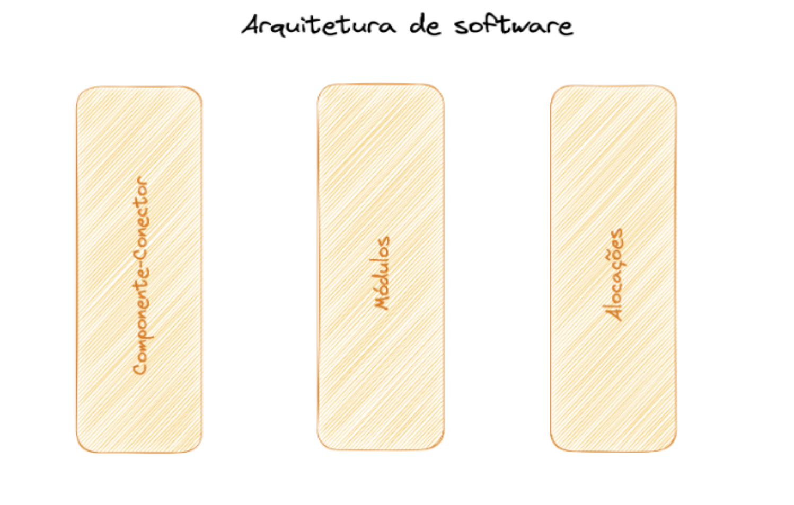

# Fundamentos de Arquitetura de Software

## Tipos de arquitetura

* Software
* Solução
* Tecnológica
* Corporativa

## Definição 
É uma disciplina da engenharia de software, diretamente ligada ao processo de desenvolvimento de software.

Afeta diretamente a estrutura organizacional da empresa.
* Formação dos times
* Estrutura dos componentes do software
* “Organizações que desenvolvem sistemas de software tendem a produzir sistemas que são cópias das estruturas de comunicação dessas empresas. (Melvin Conway)”

É a relação entre os objetivos de negócio e suas restrições com os componentes a serem criados e suas responsabilidades visando sua evolução do software.

## Papel do Arquiteto de Software

* Transformar requisitos de negócio em padrões arquiteturais.
* Orquestrar pessoas desenvolvedores e experts de domínio
* Entender de forma profunda conceitos e modelos arquiteturais
* Auxilia na tomada de decisão nos momentos de crise
* Reforça boas práticas de desenvolvimento
* Code reviews

## Arquitetura vs Design

**Arquitetura**: Escopo global ou alto nível.

**Design**: Escopo local.

*Atividades relacionadas a arquitetura de software são sempre de design. Entretanto, nem todas as atividades de design são sobre arquitetura. O objetivo primário da arquitetura de software é garantir que os atributos de qualidade, restrições de alto nível e os objetivos do negócio, sejam atendidos pelo sistema. Qualquer decisão de design que não tenha relação com este objetivo não é arquitetural. Todas as decisões de design para um componente que não sejam “visíveis” fora dele, geralmente, também não são.*  (Elemar Jr;)

## Pontos importantes

* Todo software possui uma arquitetura
* Nem todas as arquiteturas são boas arquiteturas
* Arquitetura inclui comportamentos

## Acoplamento 

O acoplamento de software se refere ao grau de interdependência entre diferentes partes ou módulos de um sistema de software. Ele descreve como os componentes de um sistema estão conectados e como as mudanças em um componente podem afetar outros componentes.

Há dois tipos principais de acoplamento:

* **Acoplamento Forte**: Isso ocorre quando os módulos de um sistema dependem fortemente uns dos outros. Isso significa que as mudanças em um módulo podem exigir alterações em muitos outros módulos. O acoplamento forte torna o sistema mais difícil de entender, manter e modificar, aumentando a complexidade.

* **Acoplamento Fraco**: Neste caso, os módulos são menos dependentes uns dos outros. Mudanças em um módulo têm menos impacto em outros módulos. Isso torna o sistema mais flexível e fácil de modificar.

Reduzir o acoplamento é geralmente uma meta importante no design de software, pois sistemas com baixo acoplamento tendem a ser mais flexíveis, modulares e fáceis de manter. Isso é alcançado através de práticas como a encapsulação, onde os detalhes internos de um módulo são ocultados, e a utilização de interfaces bem definidas para limitar as dependências entre módulos.

Por outro lado, o aumento do acoplamento pode ser justificado em alguns casos, por exemplo, quando é necessário otimizar o desempenho ou quando certos módulos estão intrinsecamente ligados e as mudanças em um devem ser refletidas nos outros.

Em resumo, o acoplamento de software é uma consideração crítica no design de sistemas de software, pois afeta sua flexibilidade, manutenção e capacidade de evolução ao longo do tempo.

### Tipos de acoplamentos

* **Operacional**: o consumidor não pode funcionar sem o provedor.
* **Desenvolvimento**: as mudanças no produtor e no consumidor devem ser coordenadas.
* **Semântica**: mudar juntos por causa de conceitos compartilhados.
* **Funcional**: mudam juntos por causa da responsabilidade compartilhada.
* **Incidental**: mudam juntos sem um bom motivo. (Por exemplo, quebrando com a alteração da API.)

[Dica](https://www.youtube.com/watch?v=esm-1QXtA2Q)

### Acoplamento aferente vs eferente

* **Componentes aferentes** normalmente possuem um nível de risco crítico, pois afetam diretamente outros componentes. Logo, atenção dobrada ao criar e manter esses tipos de componentes.
* **Componentes eferentes** por dependerem diretamente de outros componentes, normalmente estão mais propensos a falha, pois dependem diretamente do bom funcionamento de outros componentes.

### Metrificando Instabilidade

Fan-in e fan-out são termos usados para descrever o fluxo de informações dentro de um sistema de software, especialmente em relação a módulos, funções ou componentes.

* **Fan-in**: Refere-se ao número de elementos que direcionam dados ou controle para um determinado componente. Em outras palavras, é a quantidade de fluxo que entra em um determinado ponto do sistema. Um alto fan-in pode indicar que muitas partes do sistema dependem desse componente para realizar suas operações.

* **Fan-out**: Por outro lado, fan-out é o número de elementos que são acionados ou influenciados por um determinado componente. É a quantidade de fluxo que sai de um ponto do sistema para outros pontos. Um alto fan-out pode indicar que um componente tem muitas dependências ou é responsável por coordenar muitas operações em outras partes do sistema.

Calcular fan-in e fan-out envolve contar o número de conexões de entrada e saída de um componente específico. Aqui estão algumas abordagens comuns para calcular esses valores:

**Fan-in**: Para calcular o fan-in de um componente, você conta quantos outros componentes chamam ou dependem dele. Por exemplo, se uma função é chamada por cinco outras funções em um programa, seu fan-in é 5.

**Fan-out**: Para calcular o fan-out de um componente, você conta quantos outros componentes ele chama ou influencia. Por exemplo, se uma função chama outras três funções em um programa, seu fan-out é 3.

Essas métricas são úteis para entender a complexidade e a dependência dentro de um sistema de software. Um alto fan-in ou fan-out pode indicar áreas de potencial complexidade ou pontos de falha no design do sistema. Idealmente, você quer manter um equilíbrio saudável entre fan-in e fan-out para promover a modularidade e a manutenibilidade do sistema.

### Lei de Postel

Seja conservador no que você faz, mas seja liberal no que você aceita dos outros.

* Crie sistemas que sigam padrões ao enviar informações.
* Seja flexível e tolerante ao receber informações que possam ser ligeiramente diferentes do especificado.

### Lei de Lehman / Belady 

* **Lei da mudança Contínua**: Um sistema de software deve se adaptar às mudanças em seu ambiente, caso contrário, sua eficácia diminui ao longo do tempo.
* **Lei do Crescimento da Complexidade**: À medida que um sistema evolui, sua complexidade tende a aumentar, a menos que haja um esforço explícito para reduzi-la.
* **Lei da Conservação da Familiaridade**: O conteúdo global de um sistema de software deve ser mantido em um nível que seja familiar para os desenvolvedores envolvidos na sua evolução.
* **Lei da conservação do Esforço**: O esforço total para implementar e manter um sistema de software aumentará ao longo do tempo, mesmo que a quantidade de funcionalidade adicional permaneça constante.

### Perguntas de forma intencional aos módulos:

* Qual a principal responsabilidade de cada módulo?
* Quais elementos de software cada módulo utiliza?
* O que o software realmente faz e do que ele depende?
* Como cada módulo se relaciona?
* Qual o nível de acoplamento entre módulos, classes, etc?
