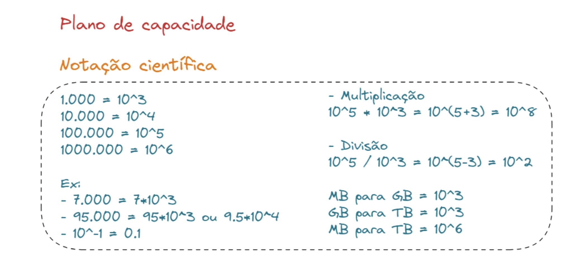
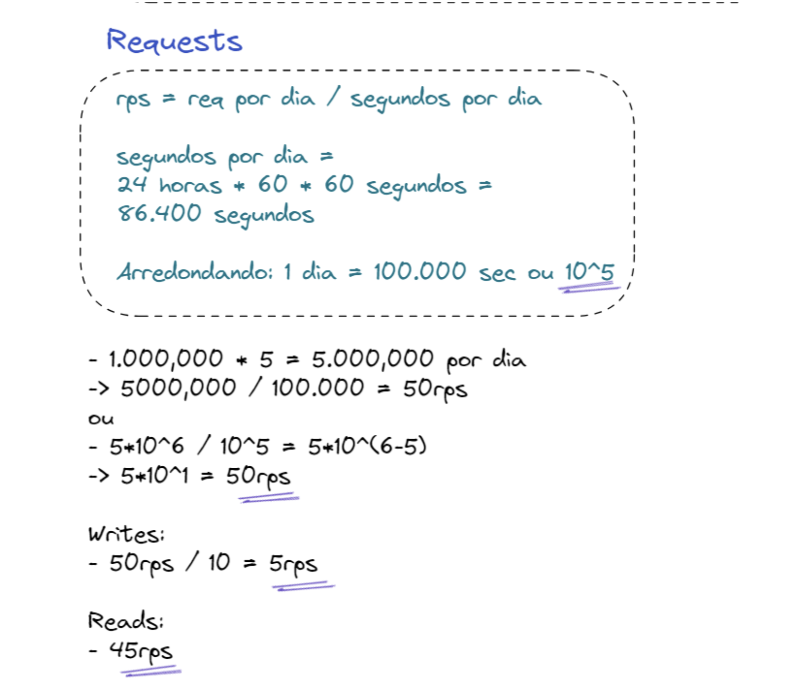

# Como calcular plano de capacidade

Calcular o plano de capacidade de um sistema é uma parte crucial do processo de arquitetura, especialmente ao projetar sistemas na nuvem. Aqui estão algumas etapas gerais que podem ajudar nesse processo:

1. Entenda os Requisitos de Negócios: Comece entendendo os requisitos do sistema e as necessidades do negócio. Isso inclui o número esperado de usuários, transações por segundo, picos de tráfego, SLAs (Service Level Agreements), entre outros.

2. Analise os Padrões de Uso: Análise os padrões de uso históricos, se disponíveis, para entender os picos de tráfego, sazonalidade e outros padrões que possam influenciar a capacidade necessária.

3. Estime a Capacidade Requerida: Com base nos requisitos e padrões de uso, faça uma estimativa da capacidade necessária para atender às demandas do sistema. Isso pode incluir recursos computacionais (CPU, memória), armazenamento, largura de banda de rede, entre outros.

4. Considere a Escalabilidade: Ao calcular a capacidade, leve em consideração a necessidade de escalabilidade. Isso pode envolver o uso de serviços escaláveis na nuvem, como instâncias EC2 auto escaláveis, bancos de dados gerenciados que se ajustam dinamicamente à carga, entre outros.

5. Planeje para Falhas: Considere também a resiliência do sistema ao planejar a capacidade. Isso inclui redundância de recursos, failover automático e outras práticas para garantir a disponibilidade contínua do sistema, mesmo em caso de falhas.

6. Monitore e Ajuste: Uma vez que o sistema esteja em operação, monitore continuamente o desempenho e a utilização dos recursos. Isso permitirá ajustes conforme necessário para atender às mudanças nos requisitos e padrões de uso ao longo do tempo.

## Notação científica

A notação científica é uma maneira de representar números muito grandes ou muito pequenos de forma mais concisa, facilitando seu entendimento e manipulação. Na notação científica, um número é representado na forma a * 10^b, onde a é um número real (chamado de mantissa) e b é um número inteiro (chamado de expoente), geralmente um número inteiro positivo ou negativo.

Para números muito grandes, o expoente b será positivo, enquanto para números muito pequenos, o expoente b será negativo. O valor de a deve estar entre 1 e 10.

Por exemplo:

- 3.00 * 10^8 representa 300.000.000 (300 milhões), que é a velocidade da luz em metros por segundo.
- 6.02 * 10^23 representa o número de Avogadro, que é a quantidade de átomos ou moléculas em um mol.
- 1.50 * 10^-3 representa 0,0015, ou 0,15%.

Para converter um número para notação científica, siga estas etapas:

1. Determine a mantissa a: Identifique os dígitos significativos do número, ou seja, os dígitos diferentes de zero que compõem o número.
2. Determine o expoente b: Conte o número de posições que a vírgula deve ser movida para a esquerda (se for um número grande) ou para a direita (se for um número pequeno) para que a mantissa seja expressa como um número entre 1 e 10.
3. Escreva o número na forma (a * 10^b): Escreva a mantissa seguida por "× 10" elevado ao expoente determinado.

Por exemplo, para o número 450.000:

1. A mantissa é 4,5.
2. A vírgula deve ser movida cinco posições para a esquerda para obter 4,5, então o expoente é 5.
3. O número em notação científica é 4,5 * 10^5.

**NOTA (Fórmulas para cálculos)**

**Cálculo request p/ segundo**: rps = req por dia / segundos por dia

**Cálculo Storage**: str = writes per sec * request size * replication factor

### Exemplo calculando as requests por dia

NOTA: Trazer para DOC, calculos feitos no caderno.
