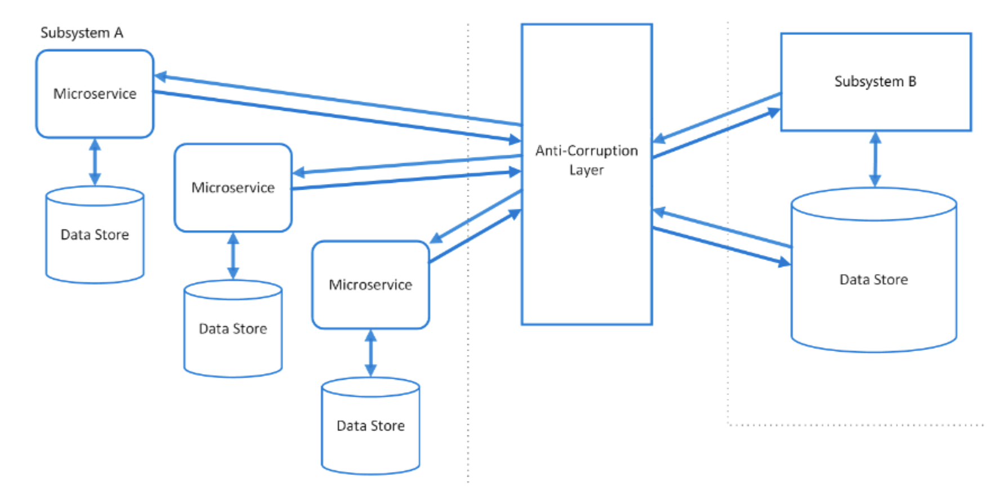

O **Anti-Corruption Layer (ACL)** é um padrão arquitetural usado para proteger e isolar o núcleo de uma aplicação ou sistema de interações diretas com sistemas legados ou externos que têm um design, estrutura, ou lógica incompatível. Ele atua como uma camada intermediária que traduz e adapta a comunicação entre o sistema moderno e o sistema legado, evitando que a complexidade ou as falhas do sistema legado "contaminem" o sistema principal.

### Objetivos do Anti-Corruption Layer:

1. **Isolamento**: Mantém o sistema moderno ou novo desacoplado do sistema legado, protegendo-o de mudanças ou da lógica ruim que pode existir no sistema antigo.
2. **Tradução**: Converte os formatos de dados e chamadas de método entre os dois sistemas, de modo que cada um possa continuar funcionando de acordo com sua própria arquitetura e design.
3. **Proteção**: Impede que problemas no sistema legado, como dependências circulares, código mal projetado, ou más práticas, influenciem o design do novo sistema.

### Quando usar um Anti-Corruption Layer:

- Quando um novo sistema ou aplicação precisa se integrar a um sistema legado com características muito diferentes, como diferentes modelos de dados, regras de negócio, ou arquitetura.
- Quando a qualidade do código ou arquitetura do sistema legado não é adequada e deve ser evitado o máximo possível no sistema novo.
- Quando você não quer ou não pode modificar o sistema legado diretamente (por exemplo, por restrições legais ou operacionais).

### Como o Anti-Corruption Layer funciona:

Imagine que você esteja modernizando parte de uma empresa que usa um sistema de ERP legado para gerenciar suas operações. Esse sistema possui uma API muito antiga e inconsistente. Ao invés de conectar diretamente o novo sistema ao ERP legado, o **ACL** age como uma camada intermediária que:

1. **Recebe solicitações** do sistema moderno (que segue boas práticas de design e uma arquitetura limpa).
2. **Traduz e adapta** essas solicitações para o formato e lógica esperados pelo sistema legado.
3. **Recebe respostas** do sistema legado.
4. **Converte essas respostas** de volta para um formato que o sistema moderno entenda.

### Benefícios do Anti-Corruption Layer:

- **Desacoplamento**: O sistema moderno não precisa ser modificado toda vez que o sistema legado muda.
- **Manutenção de Qualidade**: Evita que padrões ruins de design no sistema legado sejam propagados para o sistema moderno.
- **Flexibilidade**: Facilita a substituição futura do sistema legado, já que o sistema moderno nunca interagiu diretamente com ele, mas sim com o ACL.
- **Simplicidade**: Reduz a complexidade dentro do sistema moderno, pois o ACL lida com a lógica complexa ou inadequada do sistema legado.

### Exemplo de uso:

Imagine que sua empresa está modernizando um sistema de gestão de pedidos. O sistema legado armazena as ordens de maneira não estruturada e usa uma codificação específica para categorias de produto. Já o novo sistema de pedidos possui um modelo de dados moderno, baseado em padrões, e segue boas práticas de design.

Ao invés de integrar diretamente o novo sistema ao antigo (correndo o risco de introduzir a lógica bagunçada do legado), você cria um **Anti-Corruption Layer** que:
- Traduz os códigos de categoria do sistema legado para os identificadores do novo sistema.
- Converte os dados de pedido do legado para o formato adequado e limpo que o novo sistema espera.

### Desafios:

- **Complexidade**: O ACL pode aumentar a complexidade da arquitetura ao adicionar uma camada a mais no sistema.
- **Custo de Manutenção**: Como a camada ACL precisa ser mantida e evoluída junto com o sistema legado, isso pode gerar um custo extra.
- **Latência**: Se não for bem projetado, o ACL pode introduzir alguma latência nas interações entre o sistema moderno e o legado, especialmente se houver muita lógica de tradução envolvida.

### Ferramentas e Implementações:

- **Padrões de Mensageria** como RabbitMQ, Kafka ou outros podem ser usados em conjunto com o ACL para controlar o fluxo de comunicação.
- **APIs**: Um ACL pode ser implementado como uma API REST ou uma camada de serviços que traduz e processa os dados.
- **Adapters**: O padrão de design **Adapter** frequentemente é utilizado dentro do ACL para adaptar as interfaces de sistemas diferentes.

O Anti-Corruption Layer é um padrão crucial para sistemas que passam por modernização ou que precisam interagir com legados complexos e não aderentes às boas práticas atuais.

