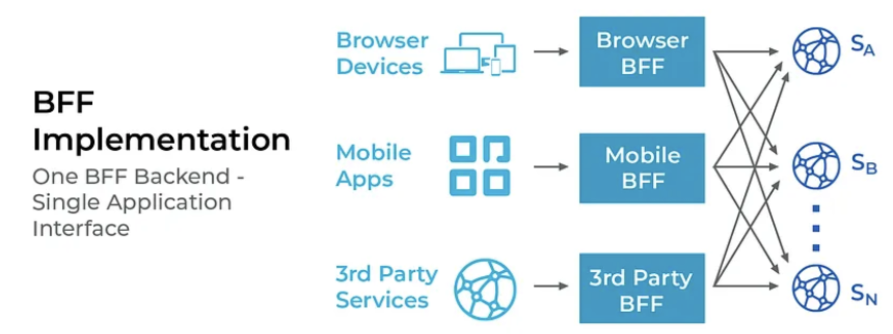

# BFF - Backend for frontend 

O BFF atua como uma interface simples entre o frontend e os microsserviços.

## Quando usar um BFF para suas aplicações

Como muitos outros padrões, o uso do BFF em sua aplicação depende do contexto e da arquitetura que você planeja seguir. Por exemplo, se seu aplicativo for um aplicativo monolítico simples, um BFF será desnecessário. Isso agregará pouco ou nenhum valor.
Porém, se sua aplicação depende de microsserviços e consome muitas APIs externas e outros serviços, é melhor usar um BFF para agilizar o fluxo de dados e introduzir muita eficiência em sua aplicação.

## Vantagens de ter um BFF

Separação de preocupações: Os requisitos de front-end serão separados das preocupações de back-end. Isso é mais fácil para manutenção.

**Mais fácil de manter e modificar APIs**: O aplicativo cliente saberá menos sobre a estrutura de suas APIs, o que o tornará mais resiliente a mudanças nessas APIs.

**Melhor tratamento de erros no frontend**: Os erros do servidor não têm sentido para o usuário frontend na maioria das vezes. Em vez de retornar diretamente os envios de erros do servidor, o BFF pode mapear os erros que precisam ser mostrados ao usuário. Isso melhora a experiência do usuário.

**Vários tipos de dispositivos podem chamar o back-end em paralelo**: Enquanto o navegador faz uma solicitação ao BFF do navegador, os dispositivos móveis podem fazer o mesmo. Isso ajudará a obter respostas dos serviços com mais rapidez.

**Melhor segurança**: Certas informações confidenciais podem ser ocultadas e dados desnecessários para o frontend podem ser omitidos ao enviar uma resposta ao frontend. A abstração tornará mais difícil para os invasores atingirem o aplicativo.

**Propriedade compartilhada de componentes pela equipe**: Diferentes partes do aplicativo podem ser gerenciadas por equipes diferentes com muita facilidade. As equipes de front-end desfrutam da propriedade do aplicativo cliente e da camada de consumo de recursos subjacentes.

## Melhores práticas a seguir na prática

**Evite implementar um BFF com APIs independentes e completas**: Suas APIs independentes devem estar na camada de microsserviços. A maioria dos desenvolvedores esquece isso e começa a implementar APIs de nível de serviço também no BFF. Você deve ter em mente que o BFF é uma camada de tradução entre o cliente e os serviços. Quando os dados são retornados de uma API de serviço, o objetivo é transformá-los no tipo de dados especificado pela aplicação cliente.

**Evite a duplicação da lógica do BFF**: Um ponto vital a ser observado é que um único BFF deve atender a uma experiência de usuário específica, não a um tipo de dispositivo. Por exemplo, na maioria das vezes, todos os dispositivos móveis (iOS, Android, etc.) compartilham a mesma experiência de usuário. Nesse caso, um BFF para todos esses sistemas operacionais é suficiente. 

**Evite confiar demais em BFF**: Um BBF é apenas uma camada de tradução. Sim, também fornece um certo nível de segurança ao aplicativo. Mas você não deve confiar mais nisso do que deveria. Sua camada API e camada frontend devem cuidar de todos os aspectos de funcionalidade e segurança, independentemente da presença de um BFF ou não.

## BFF aumentará a latência?

Um BFF é semelhante a um servidor proxy entre o cliente e outras APIs externas, serviços, etc. Se a solicitação tiver que passar por outro componente, com certeza aumentará a latência. No entanto, a latência do BFF é insignificante em comparação com o alto uso de recursos do navegador se ele precisar trabalhar com vários serviços não otimizados para o frontend.
Isto pode ser muito útil para clientes móveis em redes 2G ou 3G, onde pode levar segundos (ou mais) para estabelecer a conexão.

[Ref: The BFF Pattern (Backend for Frontend): An Introduction](https://blog.bitsrc.io/bff-pattern-backend-for-frontend-an-introduction-e4fa965128bf)