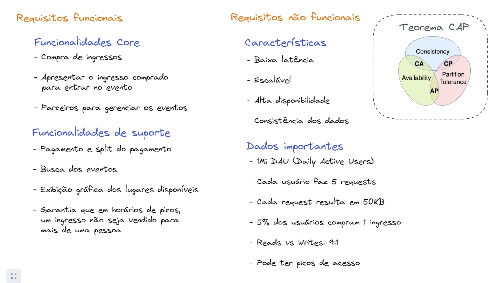

# Requisitos funcionais e não funcionais 

Os requisitos funcionais e não funcionais são dois tipos de requisitos essenciais na engenharia de software que ajudam a definir o que um sistema deve fazer e como ele deve se comportar. Aqui está uma explicação de cada um:

## Requisitos Funcionais:

Os requisitos funcionais descrevem as funcionalidades específicas que o sistema deve fornecer, ou seja, o que o sistema deve fazer em termos de comportamento e funcionalidade. Eles definem as ações que o sistema deve executar em resposta a entradas específicas e sob condições específicas. Os requisitos funcionais geralmente descrevem operações, serviços ou funções específicas que o sistema deve suportar e são frequentemente expressos em termos de casos de uso.

Exemplos de requisitos funcionais incluem:

Um sistema de e-commerce deve permitir que os usuários naveguem pelos produtos, adicione itens ao carrinho, façam pedidos, visualizem seu histórico de pedidos, etc.
Um sistema de gerenciamento de banco de dados deve permitir a inserção, atualização, exclusão e consulta de dados.

## Requisitos Não Funcionais:

Os requisitos não funcionais descrevem as características do sistema além das funcionalidades específicas que ele deve fornecer. Eles se concentram em aspectos como desempenho, segurança, usabilidade, confiabilidade, escalabilidade e outros atributos que afetam a maneira como o sistema opera, mas não estão diretamente relacionados às operações funcionais do sistema.

Exemplos de requisitos não funcionais incluem:

* Desempenho: o sistema deve responder a uma solicitação do usuário em menos de 2 segundos.
* Segurança: o sistema deve proteger os dados do usuário usando criptografia AES-256.
* Usabilidade: a interface do usuário deve ser intuitiva e fácil de usar, seguindo as diretrizes de design da empresa.
* Disponibilidade: o sistema deve estar disponível 99,9% do tempo de funcionamento, excluindo janelas de manutenção programadas.

É importante identificar e documentar tanto os requisitos funcionais quanto os não funcionais para garantir que o sistema atenda adequadamente às necessidades do usuário e aos objetivos do negócio, tanto em termos de funcionalidade quanto de qualidade e desempenho.

## Teorema CAP

O Teorema CAP, também conhecido como Teorema de Brewer, é um conceito fundamental em sistemas distribuídos que estabelece limitações sobre a consistência, disponibilidade e tolerância a partições em um sistema distribuído. 

O teorema afirma que em um sistema distribuído, é impossível garantir simultaneamente todas as três propriedades a seguir:

1. Consistência (C): Todos os nós em um sistema distribuído veem os mesmos dados ao mesmo tempo, independentemente de onde uma operação de leitura é realizada.

2. Disponibilidade (A): Todos os pedidos recebidos por um sistema distribuído devem receber uma resposta, seja ela bem-sucedida ou não, desde que o nó esteja funcionando corretamente.

3. Tolerância a Partições (P): O sistema continua a funcionar mesmo que a comunicação entre os nós seja interrompida (particionamento de rede).

O teorema afirma que, em caso de falha de rede (partição), um sistema distribuído só pode garantir consistência ou disponibilidade, mas não ambas ao mesmo tempo.

Essa ideia é frequentemente expressa graficamente como o "triângulo CAP", onde cada vértice representa uma das três propriedades (Consistência, Disponibilidade, Tolerância a Partições) e os sistemas distribuídos são posicionados em algum lugar dentro do triângulo, indicando quais propriedades são priorizadas.

Em resposta ao Teorema CAP, muitos sistemas distribuídos optam por abrir mão de uma das propriedades em favor das outras duas, dependendo dos requisitos do sistema e das necessidades do usuário. Por exemplo:

* Bancos de dados relacionais tendem a priorizar Consistência e Disponibilidade, sacrificando a Tolerância a Partições. Exemplos incluem sistemas como Oracle RAC.
* Bancos de dados NoSQL, como Cassandra e MongoDB, tendem a priorizar Disponibilidade e Tolerância a Partições, sacrificando a Consistência.
* Alguns sistemas, como o Google Spanner, tentam oferecer um equilíbrio entre as três propriedades, utilizando técnicas como sincronização global do relógio para manter a consistência mesmo em face de partições de rede.

Em última análise, a escolha entre consistência, disponibilidade e tolerância a partições depende das necessidades específicas do sistema e das tolerâncias do usuário em relação à consistência dos dados e à capacidade de resposta do sistema durante falhas.
