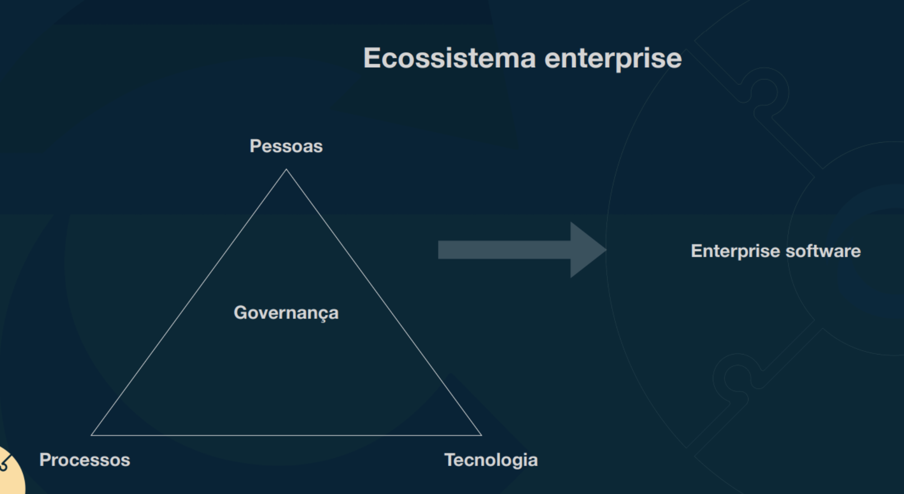

# Fundamentos Arquitetura de Solução

## Enterprise Softwares 

* Grande empresa ou uma unidade de negócios de uma grande empresa 
* Agência de governo ou uma unidade de uma agência governamental
* Multinacional que engloba diferentes tipos de negócio
* Pequenas e médias empresas que operam de forma global

### Principais características de um Sistema Enterprise

* Escalabilidade 
* Disponibilidade 
* Segurança 
* Customização / Modularização 
* Integração 
* Observabilidade

## Arquitetura de Solução

Processo de definição da estrutura, componentes, módulos, interfaces de uma solução de software para satisfazer requisitos funcionais e não funcionais bem como seu comportamento.
Também Defini/sugere a stack de tecnologia, plataformas, ferramentas, infraestrutura que serão utilizadas para implementar tal solução.

### Soft skills de um arquiteto

* Saber se adaptar em diversos tipos de projetos e contextos
* Comunicação
* Liderança
* Pensamento estratégico
* Criatividade
* Inteligência emocional
* Trabalho em equipe
* Saber ouvir

### Princípios que devem ser levados em consideração para arquitetar uma solução

* Alinhamento com objetivos de negócio
* Flexibilidade
* Reusabilidade
* Interoperabilidade
* Mantenabilidade
* Compliance com normas regulatórias
* Portabilidade

### TCO (Total Cost of Ownership)

Métrica financeira que representa o custo total de comprar, desenvolver e operar uma solução ao longo do tempo.

#### Formato de custos:

* Aquisição
* Implementação
* Manutenção
* Operação
* Inativação

### Definições de solução

#### Visão
A visão deixa claro os objetivos da solução de uma forma mais empírica, lógica e que deixe claro a sua razão de existir. 

#### Escopo
Definir os limites da solução, problemas que serão resolvidos, requisitos funcionais e não funcionais.

#### Domínio e contexto
Entendimento aprofundado do negócio, ver o negócio pelo ponto de vista dos seus participantes. (vendedores, parceiros).
 
### View e Viewpoints

#### View
Uma representação de um ou mais aspectos estruturais de uma arquitetura que ilustra como a arquitetura aborda uma ou mais questões mantidas por uma ou mais de seus stakeholders.

#### Viewpoints
É uma coleção de padrões, modelos e convenções para construir um tipo de visão.
